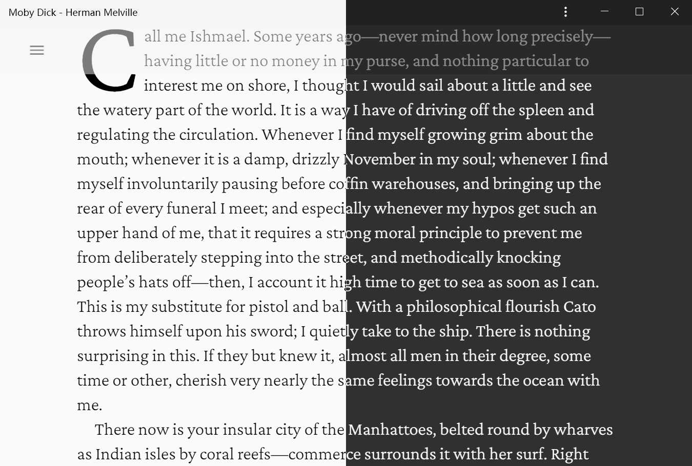

  
  
A local ePub reader for personal use.

  
  
  

<h2 align="center">Available Instances: <a href="https://m8524769.github.io/espacio/">Github Pages</a> | <a href="https://espacio.netlify.app/">Netlify</a></h2>

#### You can also [Deploy your own ESPACIO](https://github.com/m8524769/espacio/discussions/19) to do some more deeper customization.

## Font Recommendations

- Serif: [Crimson Pro](https://github.com/Fonthausen/CrimsonPro)
- Sans-serif: [Roboto](https://github.com/google/roboto)
- Monospace: [Fira Code](https://github.com/tonsky/FiraCode)

_Powered by [epub.js](https://github.com/futurepress/epub.js) and [Hypothesis](https://web.hypothes.is/)._
